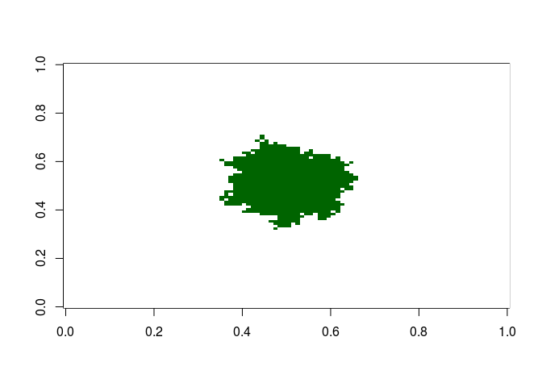
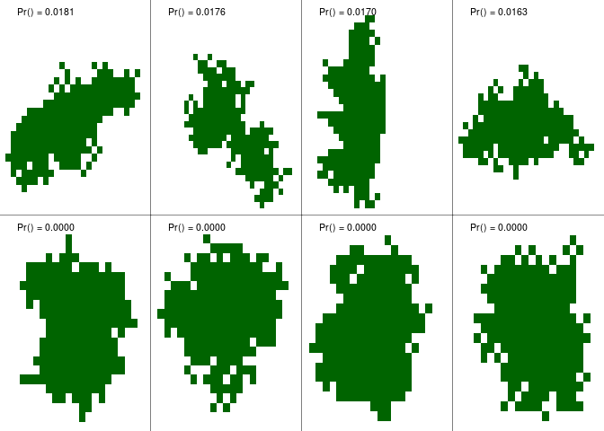

<!-- README.md is generated from README.Rmd. Please edit that file -->
grasshopper
===========

The goal of grasshopper is to ...

Example
-------

This is a basic example which shows you how to solve a common problem:

``` r
library(grasshopper)

# Simulating a patch of grass
set.seed(111)
x <- grasshopper:::sim_grass_joint(area = 500)
image(x$grass, col = c("white", "darkgreen"))
```



``` r
ans <- grasshopper(
  nsim = 1e4, # number of grass simulations
  subsim = 5e3, # number of times that we make the bug jump in each sim
  ncpus = 4
  )

# Plotting the best and the worse
plot_seq(ans)
```


