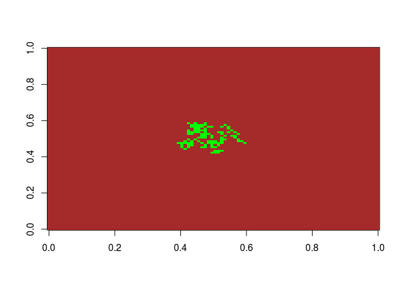
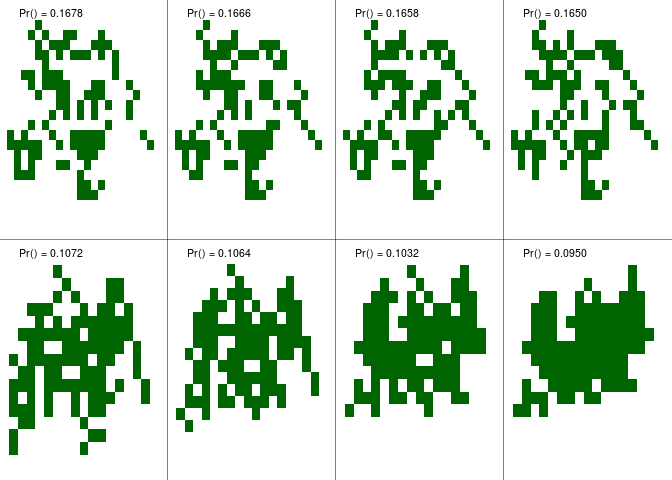

<!-- README.md is generated from README.Rmd. Please edit that file -->
grasshopper
===========

The goal of grasshopper is to ...

Example
-------

This is a basic example which shows you how to solve a common problem:

``` r
library(grasshopper)

# Simulating a patch of grass
set.seed(111)
x <- grasshopper:::sim_grass_joint(area = 700)
image(x$grass, col = c("white", "darkgreen"))
```


``` r
set.seed(2)
ans <- grasshopper(
  area = 100, len = 10,
  nsim = 10000, # number of grass simulations
  subsim = 5e3, # number of times that we make the bug jump in each sim
  ring = .99, nchanges = 10
  )
#> The new best has a prob: 0.1032 (iter #2)
#> The new best has a prob: 0.1064 (iter #3)
```


    #> The new best has a prob: 0.1230 (iter #4)


    #> The new best has a prob: 0.1254 (iter #9)


    #> The new best has a prob: 0.1302 (iter #26)


    #> The new best has a prob: 0.1332 (iter #50)


    #> The new best has a prob: 0.1376 (iter #52)


    #> The new best has a prob: 0.1408 (iter #53)


    #> The new best has a prob: 0.1418 (iter #62)


    #> The new best has a prob: 0.1436 (iter #76)


    #> The new best has a prob: 0.1456 (iter #96)


    #> The new best has a prob: 0.1490 (iter #110)


    #> The new best has a prob: 0.1554 (iter #196)


    #> The new best has a prob: 0.1574 (iter #263)


    #> The new best has a prob: 0.1592 (iter #386)


    #> The new best has a prob: 0.1604 (iter #2672)


    #> The new best has a prob: 0.1632 (iter #6068)


    #> The new best has a prob: 0.1646 (iter #6628)



    #> The new best has a prob: 0.1666 (iter #6682)


    #> The new best has a prob: 0.1678 (iter #9962)


``` r

# Plotting the best and the worse
plot_seq(ans)
```


